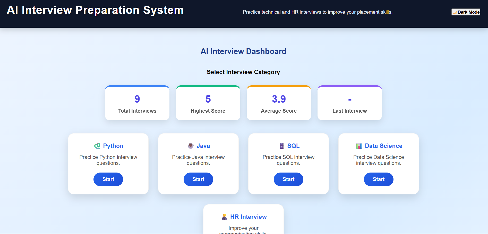
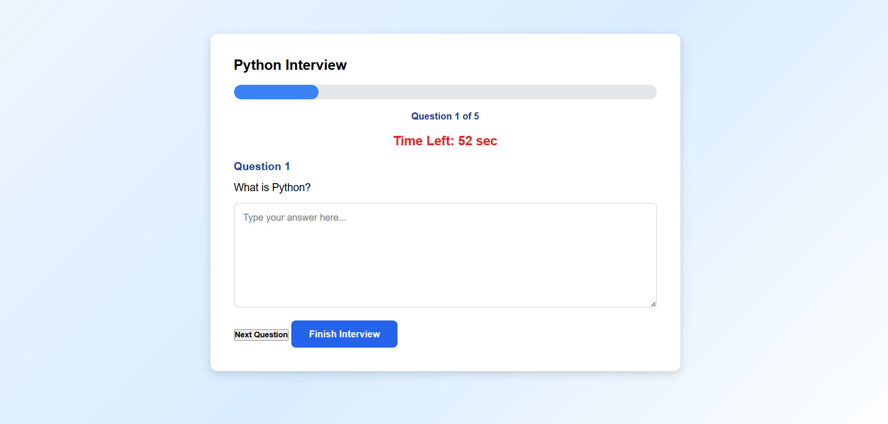
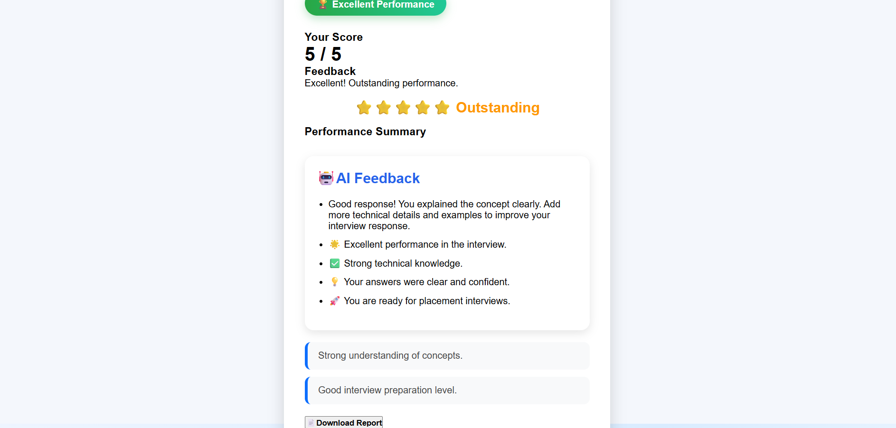

# AI Interview Preparation System

## Project Overview
AI Interview Preparation System is a web-based application that helps students and job seekers practice technical and HR interviews. It provides role-based interview questions, evaluates answers, stores interview history, and displays performance reports.

## Features
- User Registration and Login
- Role-based AI interview practice
- Technical and HR questions
- Answer submission and evaluation
- Interview score calculation
- Performance summary
- Interview history tracking
- Report generation

## Technologies Used

### Frontend
- HTML
- CSS
- JavaScript

### Backend
- Node.js
- Express.js

### Database
- MongoDB

### Tools
- Git & GitHub
- Visual Studio Code

## Project Structure

Frontend:
- index.html
- dashboard.html
- interview.html
- result.html
- history.html
- style.css
- script.js

Backend:
- server.js
- models
- routes

## How to Run the Project

1. Install dependencies:
## Project Screenshots

### Login Page

### Dashboard - Interview Categories

### Dashboard - Performance Summary

### Interview Page

### Result Page

### Interview History
